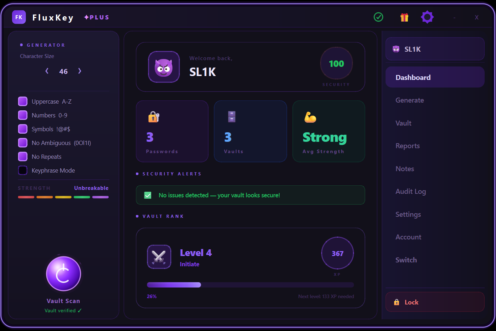

<div align="center">

](https://github.com/YOUR_USERNAME/fluxkey/releases/latest)
[](https://github.com/YOUR_USERNAME/fluxkey/releases)
[](https://github.com/fluxtool/fluxkey/releases)
[](https://discord.gg/Nxj2upuyj8)
[](https://github.com/fluxtool/fluxkey/stargazers)

<br/>

> **FluxKey is a free, offline-first password manager with a dark premium UI.**
> No subscriptions. No accounts. No data ever leaves your device.

<br/>

---

### 🚀 [Download FluxKey Free](https://github.com/fluxtool/fluxkey/releases/latest) — Windows EXE, no install needed

---

</div>

<br/>

## 📸 Preview

| 🏠 Dashboard | 🔐 Vault | ⚡ Generator |
|:-:|:-:|:-:|
|  |  |  |

| 🗒️ Secure Notes | 📊 Reports | 🎮 Vault Rank |
|:-:|:-:|:-:|
|  |  |  |

<br/>

---

## ⬇️ Download & Install

> **Zero setup. No Python. No dependencies. Just download and run.**

### Option 1 — Installer (Recommended)

1. Click **[Releases](https://github.com/fluxtool/fluxkey/releases/latest)**
2. Download `FluxKey_Installer.exe`
3. Run it. Done.

FluxKey runs entirely on your device. Nothing is sent anywhere.

### System Requirements

| | Minimum |
|---|---|
| **OS** | Windows 10 / 11 (64-bit) |
| **RAM** | 150 MB |
| **Disk** | 80 MB |
| **Internet** | Not required — fully offline |

<br/>

---

## ✨ Why FluxKey?

Most password managers are cloud-first. They store your passwords on their servers, charge a monthly fee, and ask you to trust them. FluxKey is the opposite.

**FluxKey stores everything locally on your machine, encrypted with AES-256.** No server ever touches your data. If FluxKey's servers (there are none) got hacked tomorrow, your passwords would be completely safe — because they were never online to begin with.

On top of security, FluxKey is designed to be genuinely beautiful. The dark purple UI, animated borders, smooth transitions, and clean typography make it something you actually *want* to open every day — not just a tool you tolerate.

<br/>

---

## 🔥 Features

### 🆓 Free — Forever

| Feature | What It Does |
|---|---|
| **AES-256 Encryption** | Military-grade encryption on every vault entry before it touches disk |
| **Password Generator** | Generate passwords up to 145 characters — with uppercase, lowercase, numbers, symbols, keyphrase mode, no ambiguous characters, and no repeats |
| **Animated Strength Meter** | Real-time 5-segment strength indicator from Weak to Unbreakable |
| **Vault Groups** | Organise passwords into named vaults with custom emoji icons and descriptions |
| **Pin Vaults** | Pin your most-used vaults to the top so they're always first |
| **Reorder Entries** | Drag entries up and down within any vault using ▲▼ buttons |
| **Full-Text Search** | Instantly search across all sites and usernames |
| **Action Tray** | Per-entry tray with: View, Copy Username, Copy Password, Edit, Move, Delete |
| **Password History** | Carousel of recently generated passwords — reuse any of them instantly |
| **Import & Export** | Backup or migrate your vault as a JSON file |
| **Vault Scan** | Tamper-detection integrity check — detects if your vault file was modified externally |
| **Auto-Lock** | Configurable idle timeout: 1, 5, 10, or 30 minutes |
| **Auto-Clear Clipboard** | Copied passwords are automatically wiped from clipboard after 30 seconds |
| **Multiple Profiles** | Up to 2 local user profiles — each with their own vault, avatar, and settings |
| **Security Dashboard** | Live security score, average password strength, and alert feed |
| **Vault Rank / XP System** | RPG-style progression — earn XP just by using the app, level up from 1 to 999 |
| **Beautiful UI** | Animated glowing purple border, dark theme, smooth slide animations throughout |

### ✦ FluxKey PLUS — Unlock Instantly with a Code

PLUS is a one-time upgrade activated with a `FLUX-XXXX-XXXX-XXXX-XXXX` code — no subscription, no payment form, no account needed. Enter the code in Settings and all features unlock immediately without a restart.

| Feature | What It Does |
|---|---|
| **Secure Notes** | Encrypted notes with a sidebar list and full text editor — completely separate from your vault |
| **Audit Log** | Full searchable history of every action: logins, vault saves, edits, deletes, note changes |
| **Unlimited Vaults** | No cap on vault groups — free tier is limited to 2 |
| **10 Profiles** | Up to 10 local user profiles — great for shared PCs or testing |

> 💬 **Get a PLUS code — [join the Discord](https://discord.gg/Nxj2upuyj8)**

<br/>

---

## 🔒 Security & Privacy

FluxKey was designed from the ground up to keep your data private and safe.

**Encryption:** Every password is encrypted with AES-256 before being written to disk. Your master password is never stored — only a hash of it is used to unlock the vault.

**Offline-first:** FluxKey makes zero network requests during normal operation. There is no sync server, no telemetry, no analytics, and no crash reporting. If you disconnect from the internet permanently, FluxKey works identically.

**Tamper detection:** The built-in Vault Scan checks your vault file for unexpected modifications every time you open the app. If anything looks wrong, you get an immediate warning.

**Open install:** Your vault is stored as a local file in a known location — you can back it up, copy it to a USB drive, or archive it however you like. You are never locked in to FluxKey's format.

**No ads, ever:** FluxKey will never show advertisements or allow third-party code to run inside the app. What you download is exactly what runs.

<br/>

---

## 🎮 Vault Rank System

FluxKey includes a full RPG-style progression system built around how you use the app. There are no microtransactions and no paywalls — you just earn XP by using FluxKey normally.

**How you earn XP:**

| Action | XP Earned |
|---|---|
| App is open and running | +1 XP per minute |
| Save a new password to your vault | +25 XP |

**Level formula:** XP needed to reach Level N = N² × 20. This means early levels feel rewarding and fast, while high levels are a genuine long-term grind.

**15 rank tiers across 999 levels:**

```
Level   1–10   ⚔️  Initiate
Level  11–20   🤓  Pioneer
Level  21–30   🛡️  Defender
Level  31–40   🔮  Arcanist
Level  41–50   🌙  Shadowblade
Level  51–60   ⚡  Stormcaller
Level  61–70   🔥  Infernal
Level  71–80   ❄️  Frostweaver
Level  81–90   🌊  Tidecaster
Level  91–99   🦋  Ascendant
Level 100–199  💎  Crystalline
Level 200–299  🌪️  Voidwalker
Level 300–499  🐉  Dragonbound
Level 500–899  🦁  Apex
Level 900–999  👑  Legendary
```

Your current level, rank badge, XP bar, and XP-to-next-level are displayed live on the dashboard. The level circle changes colour as you rank up — white → blue → green → violet → gold.

<br/>

---

## 🆚 Free vs PLUS

| | 🆓 Free | ✦ PLUS |
|---|:-:|:-:|
| AES-256 Password Vault | ✅ | ☑️ |
| Password Generator (up to 145 chars) | ✅ | ☑️ |
| Vault Groups | ✅ | ☑️ |
| Local Profiles | 2 | 10 |
| Pin & Reorder Vault Entries | ✅ | ☑️ |
| Password History Carousel | ✅ | ☑️ |
| Import / Export | ✅ | ☑️ |
| Vault Scan (tamper detection) | ✅ | ☑️ |
| Auto-lock & Auto-clear Clipboard | ✅ | ☑️ |
| Security Dashboard | ✅ | ☑️ |
| Vault Rank / XP System | ✅ | ☑️ |
| Animated UI & Purple Border Glow | ✅ | ☑️ |
| **Secure Notes** | ❌ | ☑️ |
| **Full Audit Log** | ❌ | ☑️ |

**PLUS is activated with a one-time code — no subscription, no payment form.**
Join the [Discord](https://discord.gg/Nxj2upuyj8) to get a code.

<br/>

---

## 📋 Changelog

### v1.0.1 — Current Release
- ✦ FluxKey PLUS system — one-time code activation (`FLUX-XXXX-XXXX-XXXX-XXXX` format), unlocks instantly without restart
- 📌 Vault group pinning — pin important vaults to the top of the list
- ↕️ Entry reorder — ▲▼ buttons per entry for full manual ordering
- 🎮 Vault Rank system — full XP progression from Level 1 to 999 with 15 rank tiers
- 💜 Animated glowing purple border around the app window
- 🕐 Recent entries section — top 3 most-recent passwords surfaced automatically
- 🔄 Real-time PLUS activation — all features unlock live, no restart needed
- 📊 Polished security dashboard with live average strength and alert feed
- 🐛 Fixed: Notes page stylesheet crash on first click
- 🐛 Fixed: `QLabel already deleted` RuntimeError during auto-lock
- 🐛 Fixed: `NameError: name 'b' is not defined` on startup

### v8 and earlier
See [Releases](https://github.com/fluxtool/fluxkey/releases) for full history.

<br/>

---

## 💬 Community & Support

**Something not working? Want a PLUS code? Have a feature request?**

The fastest way to get help is Discord — we reply fast.

[](https://discord.gg/Nxj2upuyj8)

- 💬 **[Discord](https://discord.gg/Nxj2upuyj8)** — general chat, support, PLUS codes
- 🐛 **[Issues](https://github.com/fluxtool/fluxkey/issues)** — bug reports and feature requests
- ⭐ **[Releases](https://github.com/fluxtool/fluxkey/releases)** — all versions and downloads

<br/>

---

## 🛠️ Run From Source

FluxKey is built with **Python 3.11 + PySide6**. If you want to run the source:

```bash
# 1. Clone the repository
git clone https://github.com/fluxtool/fluxkey.git
cd fluxkey

# 2. Install dependencies
pip install -r requirements.txt

# 3. Run
python main.py
```

**Dependencies:** PySide6, cryptography, and Python standard library only. No heavyweight frameworks.

---

## ⭐ Support FluxKey

FluxKey is free and built solo in spare time. If it's useful to you:

- **⭐ Star this repo** — it takes one click and helps others find FluxKey
- **🔁 Share it** — post it somewhere a privacy-conscious friend would see it
- **💬 Join Discord** — feedback and feature ideas genuinely shape the roadmap
- **🐛 Report bugs** — every bug report filed is a bug that gets fixed

Every star genuinely helps. Thank you. 🙏

<br/>

---

## 📈 Star History

[](https://star-history.com/#fluxtool/fluxkey&Date)

<br/>

---

<div align="center">

**Made with 💜 by .fluxtool**

*FluxKey — because your passwords belong to you, not to some company's server.*

<br/>

[](https://github.com/fluxtool/fluxkey/releases/latest)
[](https://discord.gg/Nxj2upuyj8)
[](https://github.com/fluxtool/fluxkey/stargazers)

</div>
